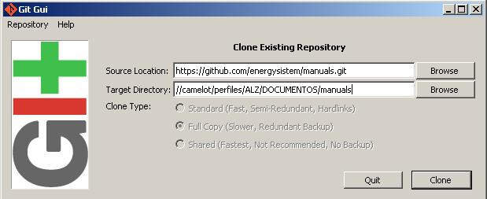
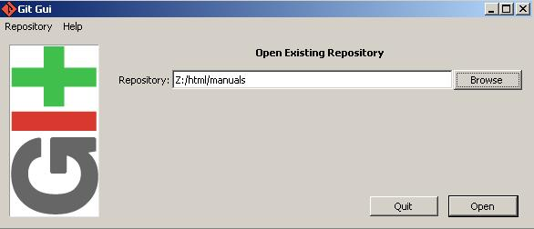
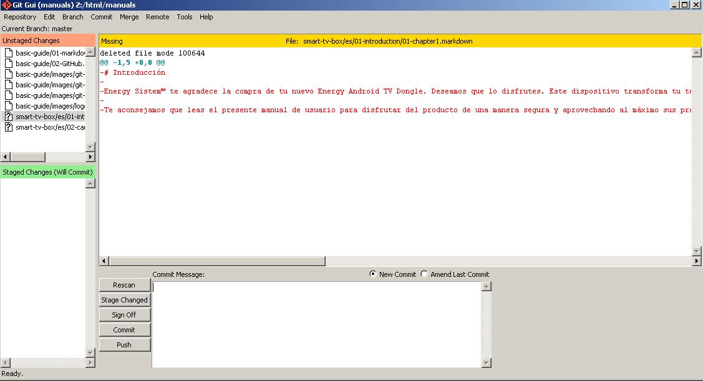

# Git / GitHub #

Una vez tenemos nuestro manual creado, queremos modificar alguno o queremos traducir necesitaremos tener una cuenta en **GitHub** y el programa **msysgit**.

## Registro en GitHub ##

Para registrarte entra en este enlace [GitHub](http://www.github.com/users).

Una vez estáis registrados, notificad a alguien del equipo web (de momento a Alfredo) que os añada a la [organización Energy Sistem en GitHub](http://www.github.com/energysistem)

## Uso de msysgit (Git) ##

> ¡Antes de empezar, hay que pedirle a Juanfran que nos lo instale!

Lo primero que debemos hacer es clonar el proyecto sobre el que deseemos trabajar a nuestra máquina:

A continuación hemos de introducir la dirección del repositorio que queremos clonar y la carpeta en la que queremos clonarlo y pulsamos *Clone*.

> **¡Importante!** La carpeta donde se va a clonar el proyecto **NO** debe existir.

Si queremos trabajar con un proyecto que ya tenemos clonado en nuestro ordenador le damos a *Open Existing Repository* de la primera imagen y luego seleccionamos la carpeta del proyecto.

Si el proyecto ya tiene contenido, el programa debería verse parecido a la siguiente figura.

* En **Unstaged changes** vemos los ficheros que hemos modificado en el proyecto
* En **Staged Changes** vemos los ficheros que se añadirán en el siguiente *commit*
* En la parte central vemos el contenido del fichero seleccionado en *Unstadged Changes*
* En la parte inferior tenemos los botones para Reescanear los cambios en el proyecto, mover ficheros de *Unstaged* a *Staged*, hacer un *commit* y hacer un *push*.

> No os asustéis, más adelante veremos este proceso que es bastante sencillo.

### Nuestro usuario ###

Una vez tenemos abierto el **msysgit** lo primero que hay que hacer es definir nuestro usuario y cambiar la codificación:

1. Vamos a Edit->Options y los datos los introducimos en las dos columnas (la del repositorio actual y en Global)
2. Introducimos nuestro *username* y *email* en GitHub
3. Cambiamos la codificación (*Default file contents encoding*), hacemos click en Change y marcamos **Unicode (UTF-8)**
4. Click en *Save*.

### 

### El "proceso" ###

Este proceso lo seguiremos cuando queramos hacer un *commit* del estado actual del proyecto o cuando queramos publicar los cambios en Internet.

1. Hacemos un *Rescan* para listar todos los ficheros modificados en la lista de **Unstaged Changes**.
2. Seleccionas los ficheros que queremos "commitear" y hacemos click en *Stage Changed* para moverlos a la lista de **Staged Changes** que como aclara entre paréntesis, hace referencia a los ficheros de los que se hará un commit.
3. Antes de hacer el commit hemos de escribir un **Commit Message** explicando qué cambios hemos hecho brevemente. Esto nos servirá para que nosotros u otras personas puedan ver el histórico del proyecto claramente.
4. Ahora ya podemos hacer el *Commit* (click en Commit :D).
5. (Opcional) Si además queremos subir los cambios a Internet hacemos click en *Push* y el último commit hecho se subirá al repositorio de GitHub. Nos pedirá nuestras credenciales de GitHub, las introducimos y profit!

### Extras ###

Git en combinación con GitHub es una herramienta muy potente para gestionar proyectos con documentos y tareas. Si quieres aprender más googlea o, aún más fácil, pregúntame (Alfredo).